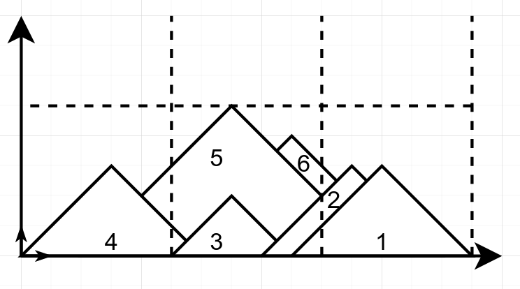

# The landscape challenge

This challenge consists of two parts. We advise you to read the instructions of both parts first before you start working on either of them. The instructions of Part 2 follow below Part 1.

## Part 1: Handling the landscape data
### Context

Your company works with data that describes landscapes in Switzerland. Unfortunately, the data that has been collected over the years is currently stored in an overly complex format. You are given the task to analyse the existing format and to write a python program that can parse the existing data into an appropriate data structure so that it can be used for further data processing (Part 2, below).

### The landscape data format
**Example data set**
```
🗻
#1
left:=#1.right-6
right=15

🗻
#2
right:=#4.center+4
altitude=3

🌳
#4
altitude=1
center=10

🗻
left=5
right=9

🗻
#3
right=6
left=0

🗻
#6
altitude:=#5.altitude+1
left:=#7.center-2

🌳
#7
altitude=2
center:=#3.right-2

🗻
#5
left=5
altitude=4
```

**Semantics**
- A landscape data set is provided in utf-8 text format. It is a collection of different landscape entities.
- Entities are separated by an empty line.
- There are two different types of entities: `Mountain` and `Tree`.
- The type of an entity is identified by its icon: 🗻 for Mountain and 🌳 for Tree.
- An entity may or may not have an `ID`. If it does, it is represented by the first line after its icon. IDs are unique.
- An entity has a `list of attributes` which are of type integer. These attributes define the position and size of the entity within the landscape. The allowed list of attributes depends on the type of entity:

    - Mountains can be defined by `(altitude, left)`, `(altitude, right)` or by `(left, right)`. It is given that the slope of all mountains is 45°, i.e. `altitude = (right - left) / 2`.
    - Trees are defined by `(altitude, center)`.
    - An attribute can reference the attribute of any entity that has an ID using the syntax `A:=#B.C+D` or `A:=#B.C-D` where
        - `A` is the attribute that references another attribute
        - `B` is the ID of the entity holding the attribute to be referenced.
        - `C` is the attribute name of the attribute to be referenced. A should be != C if the entity references itself.
        - `D` is an integer
    - Attribute references can be `transitive`. E.g. if entity #1 references entity #2 and entity #2 references entity #3, then entity #1 is automatically dependant on entity #3.
    - Referenced attributes should always point to an entity that is declared with an ID in the data set

**Syntax definition**

The formal description of the format is defined by the rules below:
- file -> entities
- newline -> "\n"
- separator -> newline + newline
- entities -> entity + separator + entities
- entities ->
- entity -> icon + newline + id + attributes
- entity -> icon + attributes
- icon -> "🗻"
- icon -> "🌳"
- id -> "#" + integer
- attributes -> mountainAttributes
- attributes -> treeAttributes
- mountainAttributes -> newline + mountainAttribute + mountainAttributes
- mountainAttributes ->
- mountainAttribute -> mountainAttributeName + "=" + integer
- mountainAttribute -> mountainAttributeName + ":=" + referencedAttribute
- mountainAttributeName -> "left"
- mountainAttributeName -> "right"
- mountainAttributeName -> "altitude"
- treeAttributes -> newline + treeAttribute + treeAttributes
- treeAttributes ->
- treeAttribute -> treeAttributeName + "=" + integer
- treeAttribute -> treeAttributeName + ":=" + referencedAttribute
- treeAttributeName -> "center"
- treeAttributeName -> "altitude"
- referencedAttribute -> id + "." + entityAttributeName + addSubOperator + integer
- entityAttributeName -> mountainAttributeName
- entityAttributeName -> treeAttributeName
- addSubOperator -> "+"
- addSubOperator -> "-"
- integer -> /\d+/

### Fetching the landscape data
The python program to develop should fetch the existing landscape data by requesting it from the webservice at `https://cern.ch/sy-epc-ccs-coding-challenge/landscape`. To ease your development process, this webservice will always return the same data set. However, while evaluating your program, we will test it with several different, bigger and some invalid data sets.

### Deliverable
Your job is to implement and extend the provided code skeleton as described below and in such a way that main.py can be run as is. You are free to modify beyond the specification and add new files to the project if you think this is necessary.

**Limitations:**
- `main.py` **must not be modified**.
- You must not rename any of the existing files / classes.
- You are not allowed to use libraries other than libraries from the Python Standard Library and your code should be compatible with python3.7.

#### `data_fetch.py`:
This file should implement a function that fetches data from a given URL and returns the response utf-8 decoded. In case the server responds with a non 2xx status code, the content of the given [fallback_file](./doc/example_data_set.txt) should be returned instead:
```python
def fetch(url: string, fallback_file: string) -> string
```

#### `landscape.py`:
The Landscape class should implement the functionality to parse the landscape data into data entities and should provide a way to access those parsed entities. You are asked to implement a method called `load` which takes care of parsing and converting the data:
```python
def load(self: Landscape, input: string) -> None
```
Furthermore, a parsed landscape should be printable in a specific format. For example, printing a landscape entity that has parsed the above mentioned example should yield the following:
```
Total number of entities: 8
Number of trees: 2
Number of mountains: 6

Entity 1
ID: 1
type: Mountain
left: 9
right: 15
height: 3

Entity 2
ID: 2
type: Mountain
left: 8
right: 14
height: 3

Entity 3
ID: 4
type: Tree
center: 10
height: 1

Entity 4
ID: None
type: Mountain
left: 5
right: 9
height: 2

Entity 5
ID: 3
type: Mountain
left: 0
right: 6
height: 3

Entity 6
ID: 6
type: Mountain
left: 2
right: 12
height: 5

Entity 7
ID: 7
type: Tree
center: 4
height: 2

Entity 8
ID: 5
type: Mountain
left: 5
right: 13
height: 4
```

#### `main.py`:
This file is the entry point of the program and shows the general workflow (fetch, parse, process). **Do not edit this file**. We will run the program via
```
python main.py
```

#### `test.py`:
Your program's functionalities should be covered by reasonable unit tests which should be specified in this file using the python built in unit testing framework `unittest`. The tests should cover both, Part 1 and Part 2 of the challenge. We will run the tests via
```
python -m unittest test.py
```

#### `area_algorithm.py`:
This file is to be implemented in Part 2 of the challenge and is not considered for the rating of Part 1.

### Code architecture

No major new feature will be added to this application once you have implemented it, but the specifications above are likely to change often in the upcoming years, and other developers might have to make these changes themselves in your code. For example, new types of entities could be introduced. You should take this into account when thinking about the architecture of your solution.

### Error Handling

It is not guaranteed that the webservice provides the landscape data in a valid format. In case the format of the retrieved landscape data is invalid, appropriate exceptions should be thrown which describe the kind of invalidity. Furthermore, these exceptions should be handled appropriately. I.e. entities that are of invalid format should be reported (e.g. print a warning) but not considered for further data processing (not parsed/stored in the landscape entity).

A format is considered invalid if it does not follow the specifications of the landscape format described above.

### Ranking Part 1:
Your code of part 1 will be evaluated on the following points (from most important to least important):

- Architecture of the code for long term maintainability
- Correctness of the program
- Clarity of the code and comments relevance
- Performance efficiency
- Code style (PEP8)

## Part 2: The mountain area algorithm
### Context

You enter the Geneva area and you see the beautiful mountains for the first time. You argue with your friend about how much mountain you can see in the landscape. You decide to find out by using the parsed landscape data of Part 1.

### Problem

You are given a list of `N` mountains in a 2D landscape, represented as triangles.

The `N` mountains are defined by:
- The x position of their bottom-left corner (`left ∈ ℕ`)
- The x position of their bottom-right corner (`right ∈ ℕ, right > left`)
- Their height (`height ∈ ℕ`)

The first element in the list `mountains[0]` represents the mountain which is the nearest from the observer (you). The last element `mountains[N-1]` represents the mountain behind all the others.

### Constraints

The constraints below are to be taken into account when implementing your solution.

**Your solution will only be tested with inputs that satisfy all of the constraints below:**

- **For simplicity, the basis of any mountain is equal to two times its height:** `right - left = 2 * height`. This also implies that all mountains have the same slope (45°)
- There are `N ∈ [0, 1000]` mountains in total
- For each mountain:
  - `left, right, height ∈ ℕ`
  - `0 <= left < right < 10^5`
  - `1 <= height <= 5 * 10^4`

### Deliverable

Your job is to implement a function that takes a list of mountains as defined above and returns the visible area of mountains from the observer point of view:

```python
def visible_area(mountains: list) -> float
```

This function should be contained in a python file named `area_algorithm.py`

You are not allowed to use libraries other than libraries from the Python Standard Library and your code should be compatible with python3.7.

**Example**



The mountains list corresponding to the landscape above is defined like this:

```python3
# Example input:
mountains = [
    {'left': 9, 'right': 15, 'height': 3},
    {'left': 8, 'right': 14, 'height': 3},
    {'left': 5, 'right':  9, 'height': 2},
    {'left': 0, 'right':  6, 'height': 3},
    {'left': 2, 'right': 12, 'height': 5},
    {'left': 5, 'right': 13, 'height': 4},
]
```

Your function will be called like this

```python3
# Testing:
area = visible_area(mountains)
print(area) # Should print 39.25 (area corresponding to the mountains given above)
```

### Ranking Part 2:
Your code of part 2 will be evaluated on the following points (from most important to least important):

- Correctness of the program
- Performance efficiency
- Clarity of the code and comments relevance
- Code style (PEP8)
